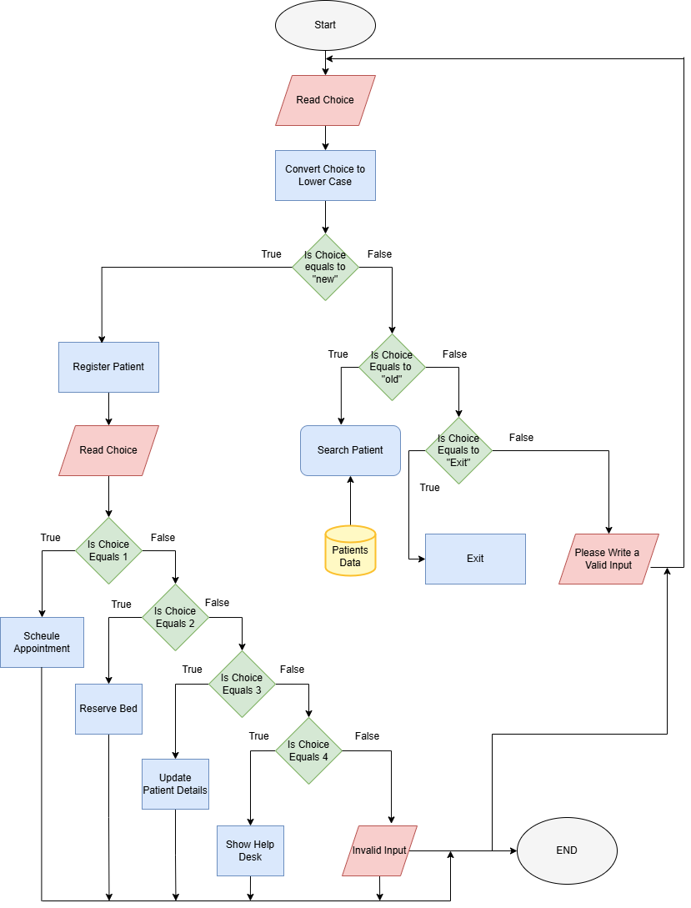

# HOSPITAL MANAGEMENT SYSTEM
The Hospital Management System is developed as my **first semester java project**. It is java based project developed using basic java conditional statements, loops, and functions. This system demostrates the use of **object oriented programming concept**, **Array of objects**  for storing patient data. This is console based system which is handled by admin staff of hospital.


## Installation
1. Clone the repo:
   ```sh
   git clone https://github.com/yourusername/yourproject.git
   ```
2. Navigate into the project directory:
   ```sh
   cd yourproject
   ```
3. Install Requirements:
   ```sh
   Java Development Kit (JDK) 11+  
Download from: [Oracle JDK](https://www.oracle.com/java/technologies/javase-downloads.html) or [OpenJDK](https://openjdk.org/)

 ## Running the Project

1. Compile the project using the following command:
   ```sh
   javac HospitalManagementSystem.java
   ```
2. run the project using the following command:
   ```sh
   java HospitalManagementSystem
   ``` 

## Features
1. **patient searching**: Search for patient by ID if already exist.
2. **patient registration**: Register new patient with patient ID, name, age, date, day, contact.
3. **patient update**: Update patient details if already exist.
4. **Appoinment booking**: Books appointment for patient with doctor on the basis of availability of doctor on specific day
5. **Bed Booking**: Book bed for patient on the basis of availability of bed in hospital implemented using 3d array indicates floor number, room number and bed number for each dimension.

## Contributions
I am still learning GitHub! If you have any suggestions, feel free to open an issue or a pull request.
